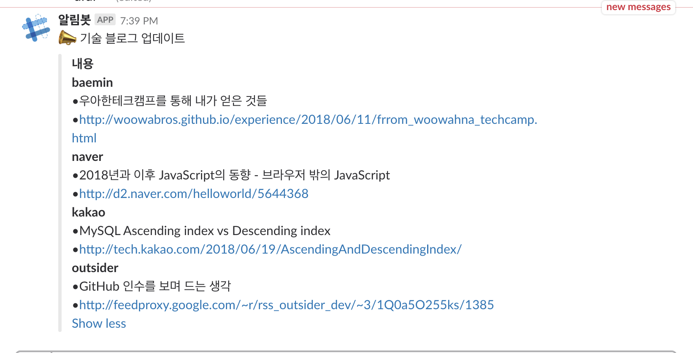

# Bot

[](https://app.codacy.com/app/namgunghyeon/bot?utm_source=github.com&utm_medium=referral&utm_content=namgunghyeon/bot&utm_campaign=badger)

 개인적으로 필요한 Bot을 폴더별로 만들어 관리

## Tech Bot

### 크롤링 대상
 - [배달의민족](http://woowabros.github.io/)
 - [outsider](https://blog.outsider.ne.kr/)
 - [naver](https://d2.naver.com/home)
 - [kakao](http://tech.kakao.com/)

새로운 내용으로 업데이트되면 아침에 슬랙으로 링크 전달

### 기술 스택
- Python 3.6
- Sqllite3

### 개발 환경 설정
```shell
cd tech_bot
virtualenv -p python3 <.evn>
. .env/bin/activate
pip install -r requirements.txt
```

### 테스트
```shell
cd tech_bot
python3 tests.py
```

### 도커
```
docker build -t bot:latest .
docker run --name bot-app bot:latest
docker ps -a
docker rm bot-app
```

### 슬랙 내용


